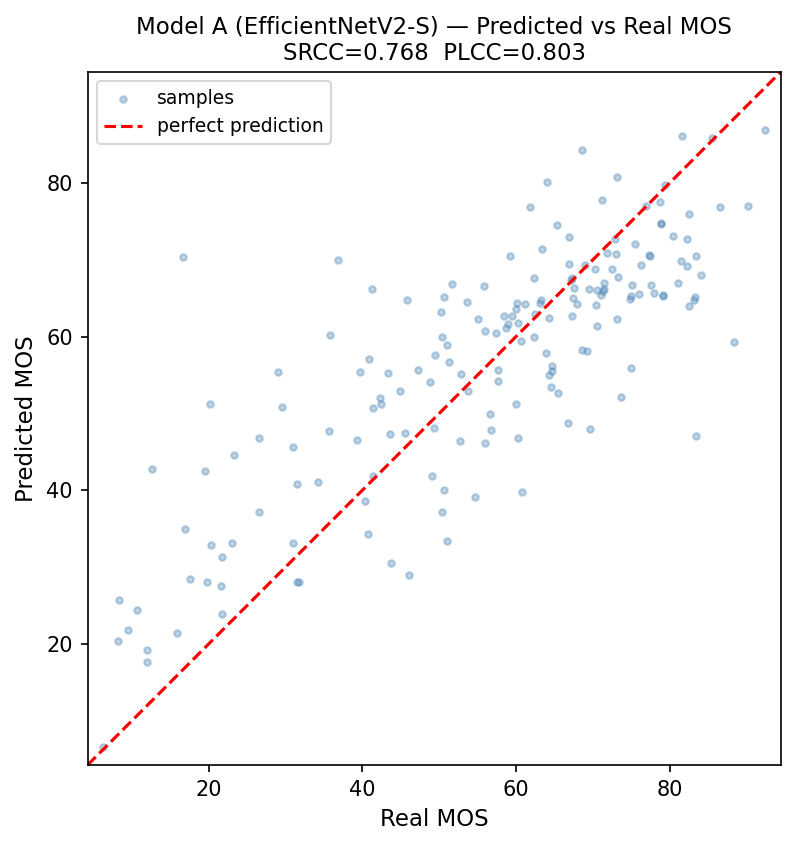
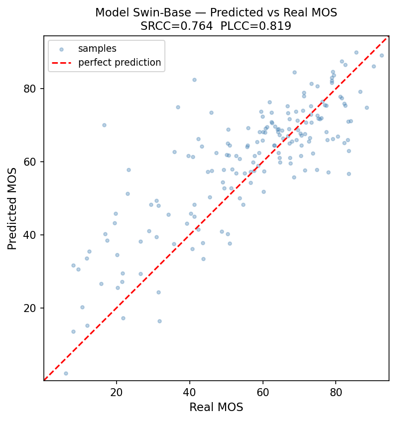
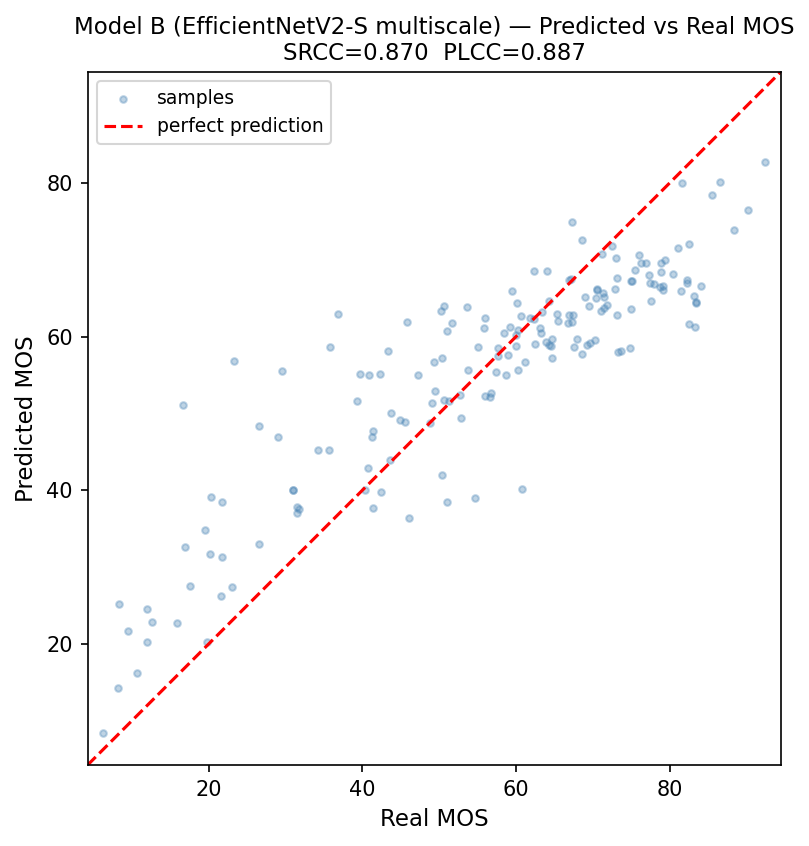
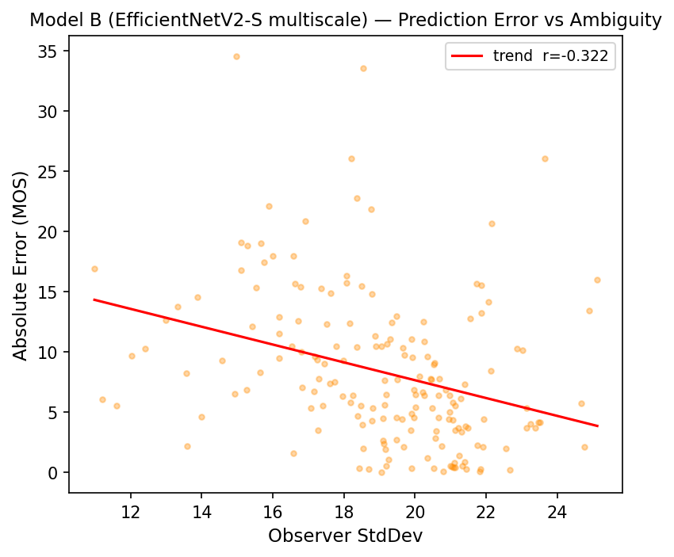
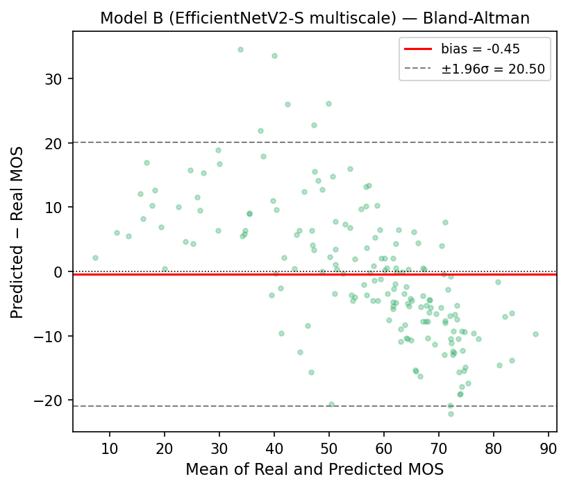
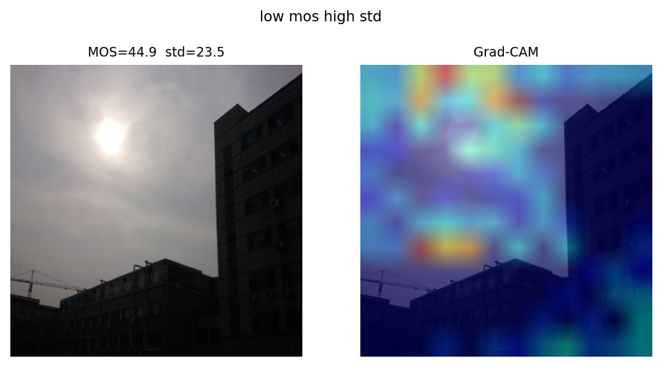
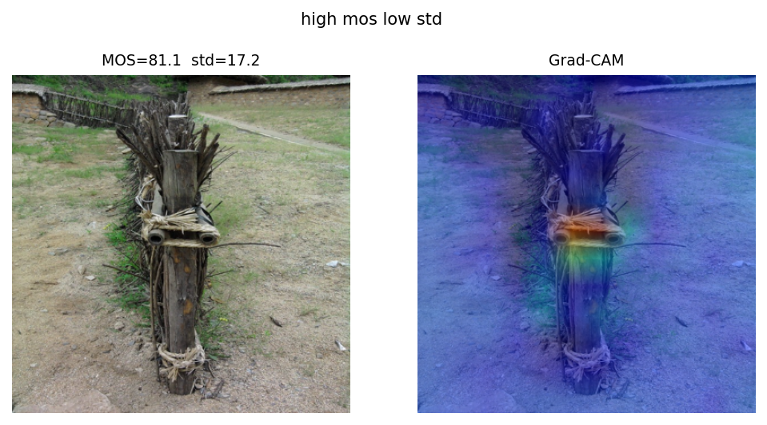

<!-- _class: lead -->
<!-- _header: '' -->
<!-- _paginate: false -->

# Blind Image Quality Assessment
## CNN vs Vision Transformer

Predire la **qualità percepita** di una foto senza immagine di riferimento

<span class="caption">Foundations of Deep Learning</span>

<!-- Apertura in 30s: regressione della qualità percepita; interessante perché non c'è ground truth "pulita" da confrontare, solo giudizi umani. -->

---

## Il task: No-Reference IQA

- **Full-Reference IQA**: confronto con l'originale (PSNR, SSIM) → facile ma irrealistico
- **No-Reference IQA**: solo l'immagine distorta → il modello deve *imparare* cos'è qualità
- Output: **MOS** (Mean Opinion Score), media dei giudizi umani su scala 0–100
- Applicazioni: fotocamere smartphone, compressione adattiva, filtri di upload

<!-- Fissare vocabolario (MOS, NR-IQA): la qualità percepita non ha formula, è apprendibile da esempi etichettati → deep learning naturale. -->

---

## Dataset: LIVE In the Wild (ChallengeDB)

<div class="cols">
<div>

- **1169 foto** da dispositivi mobili reali
- Distorsioni **autentiche** e miste (blur, rumore, sovraesposizione, compressione)
- Ogni immagine: **MOS** ∈ [0,100] + **StdDev** dei giudizi
- Split **stratificato per qualità**, seedato:
  **818 train / 175 val / 176 test**
- Sfida: **dataset piccolo** → transfer learning obbligatorio

</div>
<div>

 
<span class="caption">MOS 92 (ottima) — MOS 6 (pessima)</span>

</div>
</div>

<!-- Due punti: (1) distorsioni autentiche ≠ sintetiche = setting difficile; (2) test set di 176 immagini → leggere con cautela le differenze fini tra modelli. -->

---

## Metrica target: SRCC

- **SRCC (Spearman)**: correlazione tra i *ranking* → il modello ordina le immagini come gli umani?
- **PLCC (Pearson)**: correlazione lineare dei valori — **RMSE/MAE**: errore assoluto
- Target del progetto: **SRCC** — per le applicazioni conta l'**ordinamento**, non il valore esatto
- Conseguenza: early stopping e model selection su `val_srcc`, **non** su `val_loss`, Keras non ha SRCC built-in → callback custom.

<!-- Scelta non ovvia: un modello può avere MSE basso ma ranking mediocre. Keras non ha SRCC built-in → callback custom. -->

---

## Pipeline dati

- File `.mat` → DataFrame → `tf.data.Dataset`
- MOS normalizzato in **[0,1]** → output con **sigmoide** (predizioni sempre in scala)
- Risoluzione di lavoro: **224 baseline → 384/500 studiate** 
- Augmentation **conservativa**: flip orizzontale, luminosità ±10, contrasto 0.9–1.1
- ❌ **Vietate**: rotazioni, blur, ricompressione JPEG → *alterano la qualità → invalidano il label!*

<!-- La riga sulle augmentation vietate è il "abbiamo capito il task": in IQA l'augmentation standard distrugge il label perché la qualità È la variabile target. -->

---

## Crop nativi 384 — preservare il dettaglio (stile DeepBIQ)

<div class="cols">
<div>

- Le distorsioni (rumore, grana, compressione) vivono nei **pixel ad alta frequenza**
- Resize dell'**intera** immagine 500→384 le **sfuma**
- Invece: ritaglio **384×384 dai pixel originali**, *zero resize* → dettaglio 1:1
- 4 crop/immagine = augmentation **spaziale** (MOS ereditato), + solo **flip**

</div>
<div>

```
 Originale 500×500
   ├─ resize INTERA → 384   ✗ sfuma
   └─ crop 384×384 nativo   ✓ 1:1
          (no resampling)
```

**Test SRCC 0.842 → 0.870**
(crop frazione+resize → crop esatto)

</div>
</div>

<!-- I crop nativi sono una scelta di PIPELINE, non di modello. Punto: il backbone vuole 384 fissi, ma conta DA COSA parti — un crop nativo 384 ha densità 1:1, l'immagine intera ridotta no. Multi-crop a inferenza invece NON aiuta (la vista intera tiene il contesto globale). -->

---

## CNN baseline — single-scale

- Backbone **EfficientNet** pre-addestrato ImageNet (provati **B0** ~4M e **V2-S**, più capacità → usato per i risultati di testa)
- **Single-scale**: si usano solo le **feature finali** del backbone → GAP → testa
- Testa di regressione: Dense(512) → Dense(256) → Dense(1, sigmoid)
- È il **riferimento**: backbone forte ma **una sola scala**


<!-- Baseline forte e onesto: stesso backbone V2S della multiscala e stessa risoluzione 384 → il confronto con la multiscala è a variabile singola. -->

---

## CNN multiscala — la variante "nostra"

- Feature estratte da **3 profondità** del backbone in un solo forward pass
- texture locali (/8) · strutture (/16) · semantica (/32) → **concatenate** prima della testa
- *Ipotesi*: le distorsioni vivono a **scale diverse** (rumore = locale, composizione = globale)


<!-- Il multi-scala è la variante che validiamo: +0.089 SRCC vs single-scale a parità di backbone e risoluzione. -->

---

## Vision Transformer — Swin

- **Swin Transformer** (HuggingFace, ImageNet): **Swin-Tiny** (~28M) e **Swin-Base @384** (~88M, testa)
- Attention su **finestre locali shiftate** + gerarchia a **4 stadi** → costo lineare, piramide stile CNN
- Testa: Dense(256, GELU) → Dense(64, GELU) → Dense(1) su `pooler_output`
- **Domanda di ricerca**: l'*inductive bias* convolutivo è un vantaggio su dataset piccolo?


<!-- Slide più "da fondamenti": inductive bias vs dati. Con ~1000 immagini la teoria prevede CNN avvantaggiata; esito sfumato (slide risultati). -->

---

## Training: fine-tuning progressivo

<br>

| Fase | Cosa si allena | LR |
|---|---|---|
| **Phase 1** | solo la testa (backbone congelato) | 1e-3 |
| **Phase 2a** | layer alti (top-30 CNN / stadi 2-3 Swin) | basso |
| **Phase 2b** | backbone (quasi) intero | ridotto |

- Early stopping su **`val_srcc`** + ReduceLROnPlateau + checkpoint del best
- Ottimizzatori: **Adam** (CNN) / **AdamW + gradient clipping** (Swin, 2e-5→1e-5)
- Swin-Base @384: **graph mode** + Phase 2b limitato agli stadi 2-3 (~96% param) per non andare OOM

<!-- Perché la progressione: con dataset piccolo, gradienti da testa random distruggono feature pre-addestrate (catastrophic forgetting). Il congelamento progressivo è la difesa. -->

---

## Funzioni di loss

- **Base**: MSE sul MOS normalizzato
- **MSE + λ·(1 − PLCC di batch)**: termine di correlazione differenziabile → ottimizza ciò che misuriamo (λ=0.5 per Swin)
- **Weighted MSE**: peso `w = exp(−α·std)` → errori su giudizi *concordi* pesano di più; label rumorose pesano meno

<!-- La weighted MSE usa la StdDev (incertezza misurata del label) che quasi tutti ignorano. -->

---

## 🐛 Caso di studio: i bug del `trainable`

- **Sintomo**: lo Swin sembrava bloccato → "i transformer servono più dati"?
- **Diagnosi reale**: bug *silenzioso* del framework, non i dati
  - **tf-keras (Keras 2)**: padre con `trainable=False` **nasconde i figli** → backbone Swin mai fine-tunato
  - **Keras 3 (CNN)**: rimettere `backbone.trainable=True` **non** resetta i flag dei figli → si allenava solo il top-30
- **Aggravante**: regola LR ereditata (lr/10) = 5e-7 ≈ zero per lo Swin → passaggio ad AdamW
- **Lezione**: *loggare sempre i parametri allenabili per fase* + script di verifica

<!-- La slide migliore: la spiegazione "ovvia" era sbagliata; stesso CONCETTO di bug ha colpito entrambe le architetture in modo opposto (Keras 2 vs 3). Metodo: sintomo→ipotesi→esperimento minimo→fix verificato. -->

---

## Risultati principali (tutti @384)

<br>

| Modello | Backbone | Test SRCC | Test PLCC | RMSE |
|---|---|---:|---:|---:|
| Single-scale + crop nativi | EfficientNetV2-S | 0.768 | 0.803 | 12.41 |
| ViT | Swin-Base | 0.7638 | 0.8192 | 12.55 |
| **Multiscala + crop nativi** | EfficientNetV2-S | **0.870** | **0.887** | **10.47** |

- **Esperimento a variabile singola**: le due CNN sono identiche (V2S, 384, crop nativi 384×384, stessa ricetta) → cambia **solo** l'estrazione multiscala
- **+0.102 SRCC** (0.768 → 0.870) attribuibili al solo multiscala — miglior modello singolo del progetto
- Il ViT (Swin-Base, stesso 384) è competitivo ma sotto: **0.764**

<!-- Crop nativi = ritaglio 384×384 dai pixel originali (500×500), zero resize/upscale, stile DeepBIQ. Le due CNN differiscono per UNA sola cosa (single vs multi-scala): backbone, risoluzione, crop, flip, LR, epoche identici → Δ=+0.102 pulito sul multiscala. Test-time multi-crop NON aiuta (full-resize 0.870 > multi-crop x8 0.846 su SRCC): la vista intera tiene il contesto globale, utile per ordinare. ViT su asse diverso, per contesto. -->

---

## Risultati: predetto vs reale (test set)

<div class="cols">
<div>


<span class="caption">Single-scale V2S + crop nativi — 0.768</span>

</div>
<div>


<span class="caption">ViT Swin-Base — 0.764</span>

</div>
<div>


<span class="caption">Multiscala V2S + crop nativi — 0.870</span>

</div>
</div>

<!-- Lo scatter del modello migliore (multiscala) è più stretto sulla diagonale. -->

---

## Ablation: le due leve

<div class="cols">
<div>

**Leva 1 — Multiscala** (a parità di tutto il resto)

<br>

| | SRCC |
|---|---:|
| V2S single @384 + crop nativi | 0.768 |
| **V2S multi @384 + crop nativi** | **0.870** (+0.102) |
| B0 single @224 | 0.630 |
| **B0 multi @224** | **0.770** (+0.140) |

</div>
<div>

**Leva 2 — Risoluzione** (baseline 224)

<br>

| Modello | 224 | 384 | 500 |
|---|--:|--:|--:|
| Multi B0 | .770 | .778 | **.789** |
| V2S single | .620 | .729 | — |

Miglioramento **monotono**; limite = memoria GPU

</div>
</div>

<!-- Senza disaccoppiare le leve, il salto baseline→best mescolerebbe backbone+risoluzione+multiscala. Qui ognuna è isolata. -->

---

## Analisi degli errori (multiscala V2S)

<div class="cols">
<div>


<span class="caption">Errore vs StdDev osservatori</span>

</div>
<div>


<span class="caption">Bland-Altman</span>

</div>
</div>

- Contrariamente all'attesa, l'**errore assoluto DIMINUISCE** col disaccordo tra osservatori (**r = −0.322**)
- Le immagini a basso StdDev sono spesso proprio gli **estremi** di qualità (consenso forte) → lì l'errore assoluto è più alto: l'errore è guidato dalla **saturazione**, non dall'ambiguità
- Cala invece la **qualità di ranking** sulle immagini ad alto disaccordo: SRCC **0.88 → 0.72** (low → high std)

<!-- Onestà sui dati: la narrativa "il modello è incerto dove gli umani sono incerti" NON regge — anzi l'errore assoluto cala col disaccordo (r=-0.322), perché i casi a basso StdDev sono gli estremi di qualità dove il modello satura. Ciò che peggiora col disaccordo è il RANKING (SRCC), non l'errore assoluto. Mostrare maturità = riportare ciò che i dati dicono. -->

---

## Interpretabilità: Grad-CAM (multiscala V2S)

<div class="cols">
<div>


<span class="caption">MOS basso — il modello si concentra sulle regioni degradate</span>

</div>
<div>


<span class="caption">MOS alto — nessun difetto da segnalare, l'attenzione segue il soggetto</span>

</div>
</div>

- *Dove guarda* la CNN: su immagini degradate le attivazioni si concentrano sulle zone **sfocate / rumorose / bruciate**; su immagini di qualità (niente difetti) l'attenzione segue il **soggetto** → comportamento sensato, niente scorciatoia statistica
- Limite: non applicabile a Swin → future work (occlusion / attention maps)

---

<!-- _class: lead -->

## Conclusioni

- **Miglior modello singolo**: V2S multiscala @384 **+ crop nativi** → **SRCC 0.870**
- Le leve che contano: **multiscala** (+0.102) · **risoluzione** · **crop nativi** (384×384 dai pixel originali, zero resampling)
- ViT Swin-Base @384: **0.7638** — competitivo ma sotto al multiscala
- **L'inductive bias multiscala resta un vantaggio** a questa scala di dati

**Future work**: pre-training su KonIQ-10k · ensemble CNN+Swin · multi-seed CI · interpretabilità Swin

<!-- Chiusura: risposta alla domanda di ricerca (slide ViT) + cosa faremmo con più risorse. La battuta riprende il bug. -->
